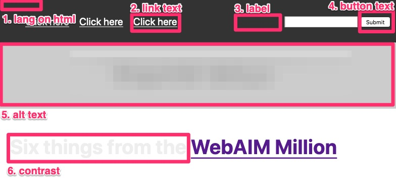

# WebAIM Million

A page /picture to help remember the big six things from the [WebAIM Million](https://webaim.org/projects/million/).

- There’s a `lang` attribute on the `html` element.
- Link text describes the destination of the link.
- Every `form` control has an associated `label`.
- `button` text describes the action that will happen.
- `alt` text for images converts the content and function of each image.
- Colour contrast is at least: 4.5:1 for normal text; 3:1 for large text (about 24px or 18px if bold); 3:1 for graphics and UI components.

